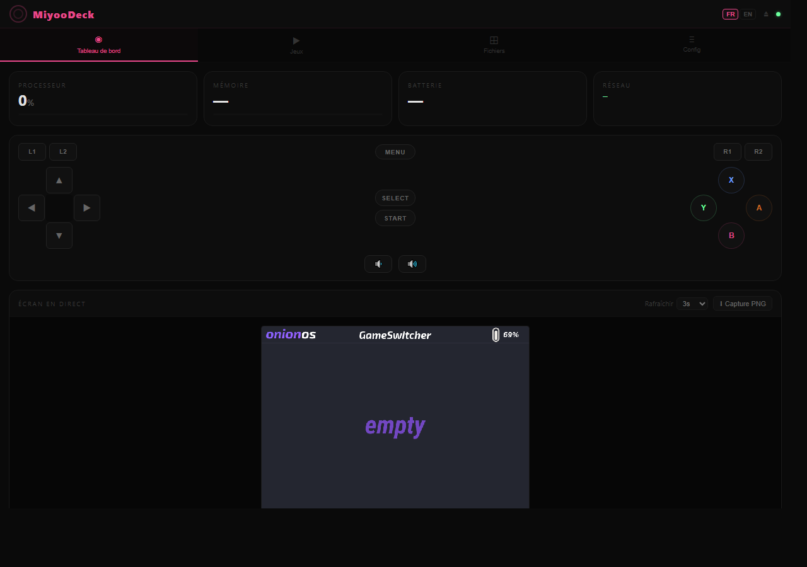

<div align="center">


# MiyooDeck 🎮

**Ton Miyoo Mini dans ton navigateur / Your Miyoo Mini in your browser**

*Un dashboard web complet pour contrôler ta console à distance*  
*A complete web dashboard to remotely control your console*

[](https://github.com/mkl159/miyoodeck/releases)
[](https://github.com/OnionUI/Onion)
[](#)
[](#)
[](#)
[](#)



</div>

---

## 🇫🇷 Français

### C'est quoi MiyooDeck ?

MiyooDeck est un **third-party pour Onion OS** qui transforme ton Miyoo Mini (ou Mini+) en console contrôlable depuis ton navigateur web. Ouvre l'interface sur ton PC ou smartphone, et tu peux :

- 📊 **Surveiller** l'état de la console (CPU, RAM, batterie, IP)
- 🎮 **Lancer des jeux** à distance d'un simple clic
- 🕹️ **Contrôler la console** avec le gamepad intégré (croix directionnelle, ABXY, L1/R1/L2/R2, SELECT/START/MENU, volume)
- 📁 **Gérer tes fichiers** — uploader des ROMs par drag & drop, télécharger tes sauvegardes
- 🖥️ **Voir l'écran en direct** avec les couleurs correctes (capture framebuffer BGR565)
- ⚙️ **Éditer les configs** RetroArch, Onion, etc. avec sauvegarde automatique
- 🔌 **Redémarrer / éteindre** la console à distance

### Prérequis

- Miyoo Mini ou Miyoo Mini+ avec **Onion OS 4.3+**
- Le WiFi configuré sur la console (Paramètres Onion > Réseau > WiFi)
- Un navigateur sur ton PC/smartphone (Chrome, Firefox, Safari)

### Installation

#### Méthode 1 — Copie manuelle (recommandée)

1. **Télécharge** la dernière version depuis la page [Releases](../../releases)
2. **Éteins** ta Miyoo Mini et **retire la carte SD**
3. **Insère la carte SD** dans ton PC
4. **Copie le dossier** `App/WebDeck/` vers `SDCARD/App/WebDeck/`

```
Carte SD/
└── App/
    └── WebDeck/          ← Copier tout ce dossier ici
        ├── config.json
        ├── launch.sh
        ├── stop.sh
        ├── webdeck        (binaire ARM)
        ├── webdeck.png    (icône)
        └── www/           (interface web)
```

5. **Éjecte** la carte SD proprement, **réinsère-la** dans la console
6. **Allume** la console

#### Méthode 2 — Build depuis les sources

```bash
# Prérequis : Go 1.21+, Node.js 18+
git clone https://github.com/TON_USERNAME/miyoodeck
cd miyoodeck

# Compiler le binaire ARM
cd server
export PATH="/c/Program Files/Go/bin:$PATH"   # Windows
GOOS=linux GOARCH=arm GOARM=7 CGO_ENABLED=0 \
  go build -ldflags="-s -w" -o ../package/App/WebDeck/webdeck .

# Compiler le frontend
cd ../frontend
npm install && npm run build

# Le package est prêt dans : package/App/WebDeck/
```

### Utilisation

1. Sur la console, ouvre **Apps > Web Deck**
2. L'adresse IP s'affiche à l'écran, ex : `http://192.168.1.42:8080`
3. Ouvre cette adresse dans ton navigateur
4. **Première fois** : crée un code PIN de protection (min. 4 chiffres) ou ignore
5. Utilise les 4 onglets :

| Onglet | Fonction |
|--------|----------|
| 📊 Tableau de bord | Stats système + gamepad + aperçu de l'écran en direct |
| 🎮 Jeux | Parcourir et lancer des jeux par système |
| 📁 Fichiers | Uploader des ROMs, télécharger les sauvegardes |
| ⚙️ Config | Éditer les fichiers de configuration |

### Arrêter le serveur

Le serveur tourne en arrière-plan. Pour l'arrêter :
```bash
# Via SSH sur la console
sh /mnt/SDCARD/App/WebDeck/stop.sh
```
Ou redémarre simplement la console.

### Ports utilisés

| Port | Usage |
|------|-------|
| 80   | Filebrowser Onion (existant) |
| **8080** | **MiyooDeck** |

---

## 🇬🇧 English

### What is MiyooDeck?

MiyooDeck is an **Onion OS third-party app** that lets you control your Miyoo Mini (or Mini+) from any web browser on your local network. Open the interface on your PC or smartphone and get:

- 📊 **Monitor** system status (CPU, RAM, battery, IP address)
- 🎮 **Launch games** remotely with a single click
- 🕹️ **Control the console** with the built-in gamepad (D-pad, ABXY, L1/R1/L2/R2, SELECT/START/MENU, volume)
- 📁 **Manage files** — drag & drop ROM upload, save games download
- 🖥️ **Live screen view** with correct colors (BGR565 framebuffer capture, 1-5 FPS)
- ⚙️ **Edit configs** (RetroArch, Onion) with automatic backup
- 🔌 **Reboot / power off** the console remotely

### Requirements

- Miyoo Mini or Miyoo Mini+ running **Onion OS 4.3+**
- WiFi configured on the console (Onion Settings > Network > WiFi)
- A web browser on your PC or smartphone

### Installation

#### Method 1 — Manual copy (recommended)

1. **Download** the latest release from the [Releases](../../releases) page
2. **Power off** your Miyoo Mini and **remove the SD card**
3. **Insert the SD card** into your PC
4. **Copy the folder** `App/WebDeck/` to `SDCARD/App/WebDeck/`

```
SD Card/
└── App/
    └── WebDeck/           ← Copy this entire folder here
        ├── config.json
        ├── launch.sh
        ├── stop.sh
        ├── webdeck         (ARM binary)
        ├── webdeck.png     (icon)
        └── www/            (web interface)
```

5. **Safely eject** the SD card and **reinsert it** into the console
6. **Power on** the console

#### Method 2 — Build from source

```bash
# Requirements: Go 1.21+, Node.js 18+
git clone https://github.com/YOUR_USERNAME/miyoodeck
cd miyoodeck

# Compile ARM binary
cd server
GOOS=linux GOARCH=arm GOARM=7 CGO_ENABLED=0 \
  go build -ldflags="-s -w" -o ../package/App/WebDeck/webdeck .

# Build frontend
cd ../frontend
npm install && npm run build

# Package ready at: package/App/WebDeck/
```

### Usage

1. On the console, open **Apps > Web Deck**
2. The IP address appears on screen, e.g. `http://192.168.1.42:8080`
3. Open that URL in your browser
4. **First time**: create a PIN (min. 4 digits) or skip
5. Use the 4 tabs:

| Tab | Function |
|-----|----------|
| 📊 Dashboard | System stats + gamepad controller + live screen |
| 🎮 Games | Browse and launch games by system |
| 📁 Files | Upload ROMs, download save backups |
| ⚙️ Config | Edit configuration files |

### Stopping the server

The server runs in the background. To stop it:
```bash
# Via SSH on the console
sh /mnt/SDCARD/App/WebDeck/stop.sh
```
Or simply restart the console.

---

## Architecture technique / Technical Architecture

```
MiyooDeck
├── server/           Go backend (ARM daemon)
│   ├── main.go       HTTP server + auth + routing
│   ├── system.go     CPU/RAM/battery via /proc & /sys (async sampling)
│   ├── files.go      File listing, upload, zip extraction
│   ├── games.go      ROM listing + game launch
│   ├── config.go     Config file editor + .bak backup
│   ├── screenshot.go /dev/fb0 → PNG (auto-detect 16/32-bit, FBIOGET_VSCREENINFO)
│   ├── input.go      Button injection → /dev/input/event0 (Onion keycodes)
│   ├── power.go      Reboot / poweroff endpoint (sync before halt)
│   ├── websocket.go  Real-time stats + screenshot broadcast (panic-safe)
│   └── mdns.go       mDNS responder → miyoodeck.local
└── frontend/         Svelte 4 + Vite SPA
    └── src/
        ├── i18n.js           FR/EN translations
        ├── api.js            API client + WebSocket
        ├── App.svelte        Layout + auth + lang switcher
        └── components/
            ├── Dashboard.svelte    Stats + gamepad + live screen
            ├── Controller.svelte   Gamepad UI (D-pad, ABXY, shoulders…)
            ├── GameLauncher.svelte
            ├── FileManager.svelte
            └── ConfigEditor.svelte
```

**Binary size**: ~6.5 MB (stripped ARM)  
**Frontend size**: ~63 KB JS + 24 KB CSS  
**Total package**: ~6.6 MB  
**RAM usage**: ~8 MB at rest, ~12 MB under load

## Fonctionnement interne / How it works

### Lancement de jeu / Game launching
MiyooDeck écrit une commande dans `/mnt/SDCARD/.tmp_update/cmd_to_run.sh` et envoie `killall -9 MainUI`. Le runtime Onion détecte ce fichier et lance le jeu automatiquement.

MiyooDeck writes a command to `/mnt/SDCARD/.tmp_update/cmd_to_run.sh` and sends `killall -9 MainUI`. Onion's runtime detects this file and launches the game automatically.

### Capture d'écran / Screenshot
Le framebuffer `/dev/fb0` est lu via `FBIOGET_VSCREENINFO` pour auto-détecter le format pixel au runtime : **BGR565 16-bit** (Miyoo Mini original) ou **ABGR8888 32-bit** (Miyoo Mini Plus). L'image est corrigée en rotation 180° et encodée en JPEG pour la diffusion WebSocket (5× plus rapide que PNG sur ARM).

The framebuffer `/dev/fb0` is queried via `FBIOGET_VSCREENINFO` to auto-detect the pixel format at runtime: **BGR565 16-bit** (original Miyoo Mini) or **ABGR8888 32-bit** (Miyoo Mini Plus). The image is corrected for 180° rotation and encoded as JPEG for WebSocket streaming (5× faster than PNG on ARM).

### Contrôleur / Controller
Les pressions de boutons sont injectées dans `/dev/input/event0` via des structs `input_event` Linux (16 octets, ARM 32-bit). Les codes touches correspondent à `keymap_hw.h` d'Onion OS.

Button presses are injected into `/dev/input/event0` via Linux `input_event` structs (16 bytes, ARM 32-bit). Key codes match Onion OS's `keymap_hw.h`.

### Mode veille / Sleep mode
Aucun client WebSocket connecté = la diffusion stats/screenshot s'arrête automatiquement pour économiser les ressources du processeur.

No WebSocket clients connected = stats/screenshot broadcast stops automatically to save CPU resources.

## Sécurité / Security

- PIN optionnel (hash SHA-256 stocké dans un fichier)
- Réseau local uniquement — pas d'accès internet
- Accès fichiers limité à `/mnt/SDCARD`
- Tokens de session en mémoire (expiration 24h)

---

## Licence / License

MIT — Projet non officiel, non affilié à l'équipe Onion OS.  
MIT — Unofficial project, not affiliated with the Onion OS team.

---

<div align="center">
  <sub>Fait avec ❤️ pour la communauté Miyoo / Made with ❤️ for the Miyoo community</sub>
</div>
